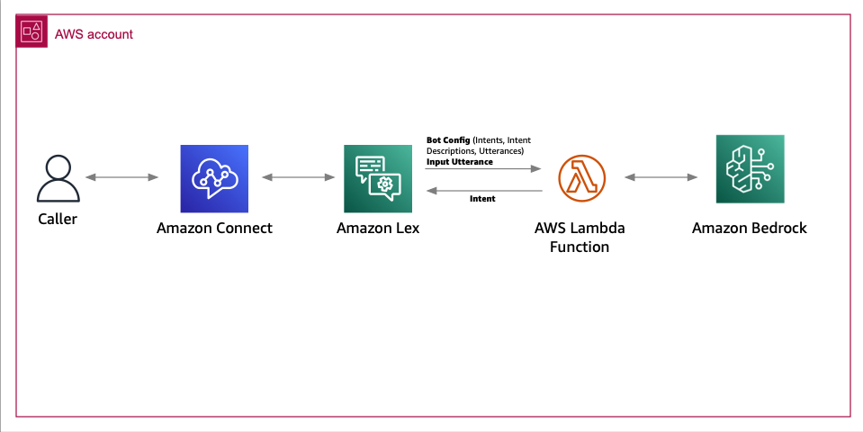

# Enhancement Of Amazon Connect And Amazon Lex With GenAI Capabilities

In this solution, we showcase a practical application of Amazon Connect integration with Amazon Lex and Amazon Bedrock/Titan to improve the understanding of intents.

## Overvview of the solution
The solution is composed of an Amazon Connect instance with a contact flow with a ‘Get Customer Input’ block that uses Amazon Lex. Amazon Lex is configured with an AWS Lambda Function to process utterances for which the intent cannot be determined and gets routed to the FallbackIntent. 


**Figure1 – Architecture**

## Getting started

### Prerequisites

For this solution, you need the following prerequisites:
* A basic understanding of the Amazon Connect contact center solution using Amazon Lex and Amazon Bedrock
* An AWS account [https://docs.aws.amazon.com/signin/latest/userguide/what-is-sign-in.html] with an AWS Identity and Access Management (IAM)[https://aws.amazon.com/iam/] user with permissions to deploy the CloudFormation template [https://aws.amazon.com/iam/]
* The AWS Command Line Interface (AWS CLI)[https://aws.amazon.com/cli/] installed and configured for use[https://docs.aws.amazon.com/cli/latest/userguide/cli-chap-configure.html].
* Docker[https://docs.docker.com/get-docker/] installed and running for building the AWS Lambda container image.
* Python 3.9 or later, to package Python code for the Lambda function.
* jq installed[https://jqlang.github.io/jq/download/]

### Deploy the sample solution

From within the directory where you've downloaded this sample code from Git, do the following to deploy the solution to your AWS account.

1. Run the following command to initialize the environment and create an ECR repository for our Lambda Function's image. Provide the AWS region and Amazon ECR repository name that you would like to create.

```bash
bash ./scripts/build.sh region respositry-name
 …
"123456789.dkr.ecr.us-east-1.amazonaws.com/test:latest"
```

2. Update ParameterValue fields in parameters.json file. Save the file.
  Open scripts/parameters.json
  * ParameterKey ("AmazonECRImageUri")     : Repository url from the previous step.
  * ParameterKey ("AmazonConnectName")     : Unique name.
  * ParameterKey ("AmazonLexBotName")      : Unique name.
  * ParameterKey ("AmazonLexBotAliasName") : Default is "prodversion", change if needed.
  * ParameterKey ("LoggingLevel")          : Default is "INFO", change if required. Valid Values are INFO, DEBUG, WARN, ERROR.
  * ParameterKey ("ModelID")               : Default is "anthropic.claude-instant-v1", change if you need to use a different model
  * ParameterKey ("AmazonConnectName")     : Default is "0.75", change if you need to update the confidence score.


3. Run the command to generate the cloudformation stack and deploy the resources.

```bash
bash ./scripts/deploy.sh region cfn-stack-name

"Successfully created CloudFormation stack".
```

4. If you do not want to build the contact flow from scratch in Amazon Connect, import the sample flow provided with this repository.

  * Log in to your Amazon Connect instance. The account must be assigned a security profile that includes edit permissions for flows.
  * On the navigation menu, choose Routing, Contact flows.
  * Create a new flow of the same type as the one you are importing.
  * Choose Save, Import flow.
  * Select the file to import, and choose Import. When the flow is imported into an existing flow, the name of the existing flow is updated, too. [filelocation: /contactflowsample]
  * Review and update any resolved or unresolved references as necessary.
  * To save the imported flow, choose Save. To publish, choose Save and Publish.
  * After uploading the contactflow, update the following configurations
     - 'GetCustomerInput' blocks with the correct lexbot name and version. Save and Publish the contact flow.
     - Under 'Manage Phone Number', update the phone with contactflow/IVR imported earlier.

## Clean up
Run the command to delete the Amazon ECR repository and cloudformation stack.
```bash
bash ./scripts/cleanup.sh region repositry-name cfn-stack-name
 …
Successfully deleted CloudFormation stack..
```

## Authors and acknowledgment
* Hamza Nadeem
* Parag Srivastava
* Ross Alas
* Sangeetha Kamatkar

## Contributing
TBD


